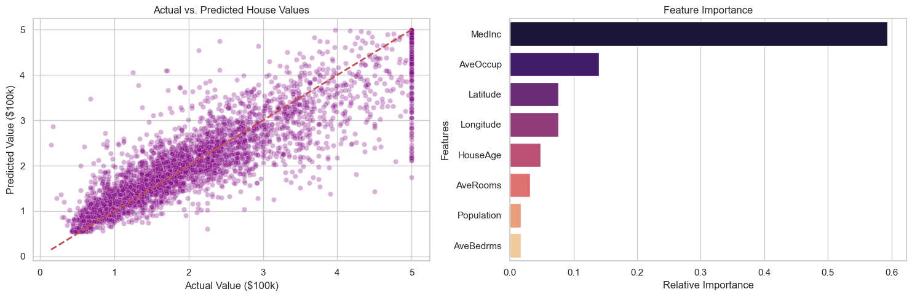

# California Housing Price Prediction Pipeline

A clean and simple Machine Learning project built to predict median house values in California using a Random Forest Regressor. It takes raw housing data, processes it, trains an AI model, and visualizes the results.

---

## 🚀 How the Pipeline Works

The project follows a standard 5-step machine learning workflow:
1. **Import:** Loads the local dataset (`housing.csv`) containing California demographic data.
2. **Split:** Divides the data into **80% Training** (to teach the model) and **20% Testing** (to evaluate accuracy).
3. **Train:** Trains a Random Forest Regressor model to find patterns between housing features and prices.
4. **Predict:** Generates price predictions on the test data and evaluates performance using standard metrics (MAE and $R^2$).
5. **Visualise:** Automatically creates and saves plots to analyze how well the model performed.

---

## 📊 Visualizations & Insights

### Model Performance & Feature Weights
The pipeline automatically exports your results into a combined visual layout. The charts help you check your model's prediction accuracy (left) and discover exactly which features (like median income or location) have the biggest impact on housing prices (right).



---

## 🗃️ Dataset Features

The model analyzes the following information from `housing.csv` to predict the **median house value**:

* **Location:** Longitude and latitude coordinates.
* **Neighborhood Metrics:** Housing median age, total rooms, and total bedrooms.
* **Demographics:** Population, total households, and median income of the residents.

---

## 🛠️ Quick Start

### 1. Install Requirements
Install the required data science libraries using the project's setup file:
```bash
pip install -r requirements.txt
2. Run the Model
Run the pipeline script to execute the entire process from data loading to generating the final visualization:

Bash
python pipeline.py
🗂️ Project Structure
pipeline.py – The complete, step-by-step machine learning Python code.

housing.csv – The dataset containing historical California housing metrics.

requirements.txt – The list of Python libraries needed to run the script.

images/ – The folder where the generated performance plots are saved.